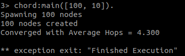
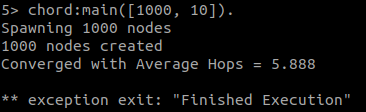
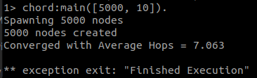
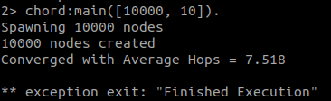
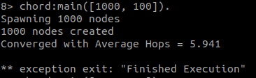
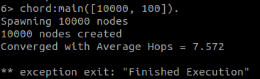
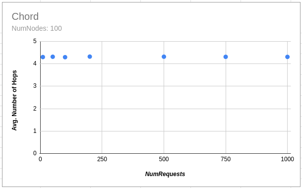
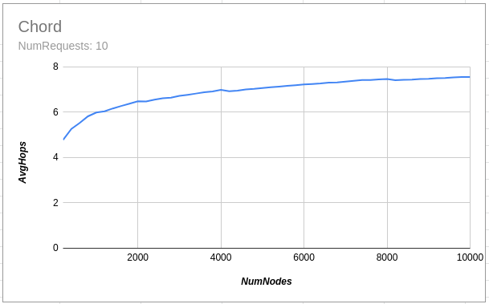

# Project 3

## Group Members
### Raj Vora - 35551411
### Rushil Patel - 66999320

## Problem Definition

The goal of this project is to implement the Chord protocol and a simple object access service to prove it's usefulness using Erlang and Actor Model.

## Compile

> `> erl `  
> `> c(chord).`  
> `> c(peer). `  

##  Execute (erlang shell)
> `> erl`  
> `> chord:main([Nodes, Requests]). `

Where `Nodes` is the number of peers to be created in the peer-to-peer system and `Requests` is the number of requests each peer has to make. When all the peers complete that many requests, the program will exit. Each peer sends a request/second.

## Working

We managed to run Chord protocol for maximum 10000 nodes and 100 messages

  
  
  
  
  
  
  

## Some Observations

- Average Hops primarily depends on the Number of Nodes doesn't really depend on the Number of Requests.

  

- Number of Requests mainly elongates the running time of the program and adds some random noise to the output and nothing else.
  
  
  
- As the number of nodes increases, average hops also increase but in a logarithmic fashion

  

## 